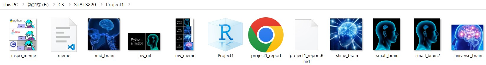
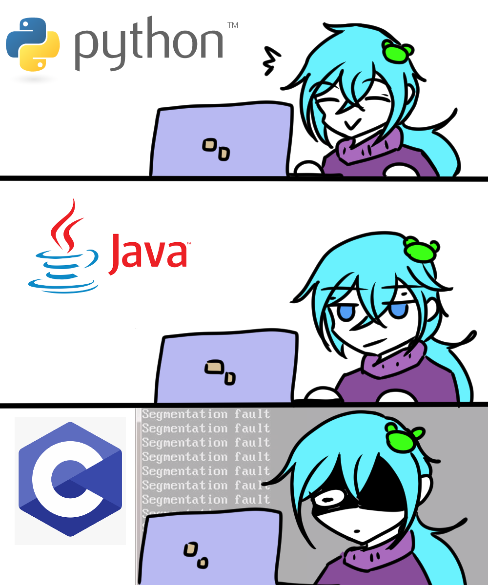
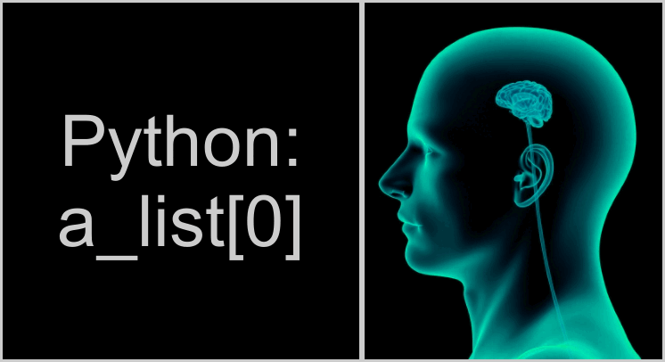

```{r setup, include=FALSE}
knitr::opts_chunk$set(echo=TRUE, message=FALSE, warning=FALSE, error=FALSE)
library(magick)
```

```{css}
h1 {
  color: #fdfdfd;
  background-color: purple;
  padding: 3px 6px;
  border-bottom: 5px solid black;
}

a:link, a:visited {
  text-decoration: none;
  transition: 0.3s;
}
a:hover, a:active {
  color: red;
}

p {
  font-size: 16px;
  line-height: 1.6;
}

img {
  padding: 10px;
  margin: 10px;
}
```

## Project requirements
I have met the requirements related to GitHub as I have set up a repository for STATS 220 and included a README.md file. In that file, I explained what this repository contains as well as the different languages I will be using along with the reasons why I created the README.md file. I have used two different levels of headers (# and ##), an ordered list for the reasons of this file, an unordered list for the languages I will use, bold key words and italic semester date, and a link to ChatGPT.

Here is a link to that repository: 
[Stats 220 Repository](https://github.com/Zhiguang729/stats220)

Here is a screenshot of the project folder:


## My meme

The components that I changed are the images, the layout, the number of images and the text content. I changed the images to the brain meme (see below). The layout becomes two images side by side to form a row and there and four rows. I also change the meme content related to arrays. 


```{r meme-code, eval=TRUE}
#small brain text
small_brain_text <- image_blank(width = 400, 
                               height = 400,
                               color = "#000") %>%
  image_annotate(text = "Python:\na_list[0]",
                 color = "#fff",
                 font = "Sans Serif",
                 size = 80,
                 gravity = "center"
                 ) %>%
    image_border("white", "3x3")

# small brain
small_brain <- image_read("small_brain2.jpg") %>%
  image_flop() %>% 
    image_border("white", "3x3")

first_row = image_append(c(small_brain_text, small_brain))

#mid brain text
mid_brain_text <- image_blank(width = 400, 
                                height = 400,
                                color = "#000") %>%
  image_annotate(text = "Java:\narray[0]",
                 color = "#fff",
                 font = "Sans Serif",
                 size = 80,
                 gravity = "center") %>%
    image_border("white", "3x3")

# mid brain
mid_brain <- image_read("mid_brain.jpg") %>%
  image_border("white", "3x3")

second_row = image_append(c(mid_brain_text, mid_brain))

#shine brain text
shine_brain_text <- image_blank(width = 400, 
                              height = 400,
                              color = "#000") %>%
  image_annotate(text = "C:\narray[0]",
                 color = "#fff",
                 font = "Sans Serif",
                 size = 80,
                 gravity = "center") %>%
    image_border("white", "3x3")

# shine brain
shine_brain <- image_read("shine_brain.jpg") %>%
  image_border("white", "3x3")

third_row = image_append(c(shine_brain_text, shine_brain))


#universe brain text
universe_brain_text <- image_blank(width = 400, 
                                height = 400,
                                color = "#000") %>%
  image_annotate(text = "R:\nvector[1]",
                 color = "#fff",
                 font = "Sans Serif",
                 size = 80,
                 gravity = "center") %>%
    image_border("white", "3x3")

# universe brain
universe_brain <- image_read("universe_brain.jpg") %>%
  image_border("white", "3x3")

forth_row = image_append(c(universe_brain_text, universe_brain))


images = c(first_row, second_row, third_row, forth_row)

my_meme = image_append(images, stack = TRUE)

my_meme

image_write(my_meme, "my_meme.png")

```


```{r animation-code, eval=FALSE}
my_gif <- image_morph(images) %>%
  image_modulate(brightness = 80, saturation = 120, hue = 90) %>%
    image_animate(fps = 10)
my_gif

image_write(my_gif, "my_gif.gif")

```


## Creativity
I used some additional functions from the magick package, including image_flop which flips and image on the y-axis, image border which creates a coloured border around an image for clearer separation, and image_modulate to change the saturation etc.

I have also used additional CSS code. This includes adding a bottom border, added hover effect and removed the underline for anchor elements (links), added line height and font size for p elements to increase readability.

## Learning reflection
One important idea I learned was the use of MarkDown. I have seen many GitHub repositories with a README.md file and didn't really know what .md is. Now after the lectures of week 1 and 2, I understood that MarkDown is a simpler way of creating the skeleton of the a webpage and it is used to generate HTML. I also learned some of the important syntax of R such as the pipe syntax "%>%". The pipe syntax use the return value of the previous function as the first argument of the function after the pipe. 

I want to learn more about how and why R is a good language for data science. For example how does R generate different plots/graghs.
